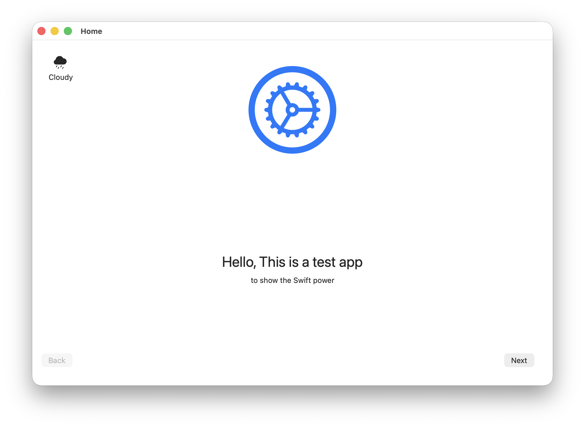
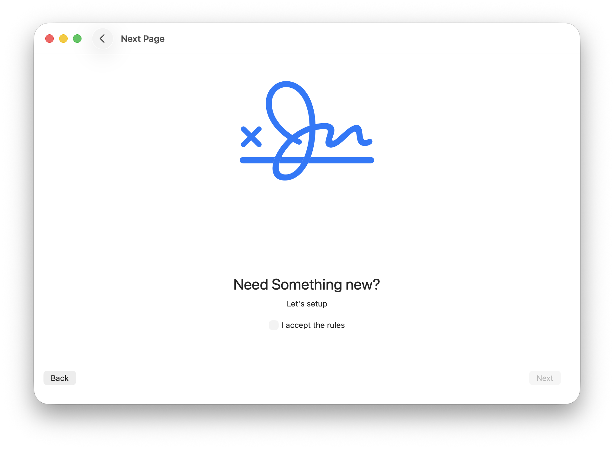

# 🎉 v1.0.0 – SwiftDemoProject for macOS 🚀

  

**SwiftUI macOS demo app** showcasing basic navigation, state management, and a liquid-glass styled icon. Perfect as a starter template or learning playground!

---

## ✨ Highlights

- **Pure SwiftUI**  
  Declarative views, live Previews, and modern macOS design patterns.

- **Navigation & Dialogs**  
  ✔️ Confirmation dialogs  
  ✔️ `NavigationStack` for smooth screen transitions

- **State Management**  
  `@State` bindings for reactive UI updates.

- **Liquid-Glass Icon**  
  A glossy orange Swift-bird icon using Apple’s “liquid glass” aesthetic.

- **Zero Dependencies**  
  No external packages—just SwiftUI and standard frameworks.

---

## 📸 Screenshots

  
  

---

## 🛠 Installation

1. Download the DMG or ZIP from the [Releases page](https://github.com/ihoooman/SwiftDemoProject/releases).  
2. Mount the disk image and drag **SwiftDemoProject.app** to your **Applications** folder.  
3. Launch from **Launchpad** or **Finder ▶ Applications**.

---

## 📝 Release Notes

- Initial release of SwiftDemoProject  
- Added App entry point (`@main`) and refactored `ContentView`  
- Fixed UI text typos and improved layout  
- Integrated automated icon generator for all required sizes  
- Set up unit & UI test targets with CI build & test workflow

Enjoy exploring SwiftUI on macOS! If you run into any issues, feel free to [open an issue](https://github.com/ihoooman/SwiftDemoProject/issues).

---

_Last updated: July 8, 2025_
